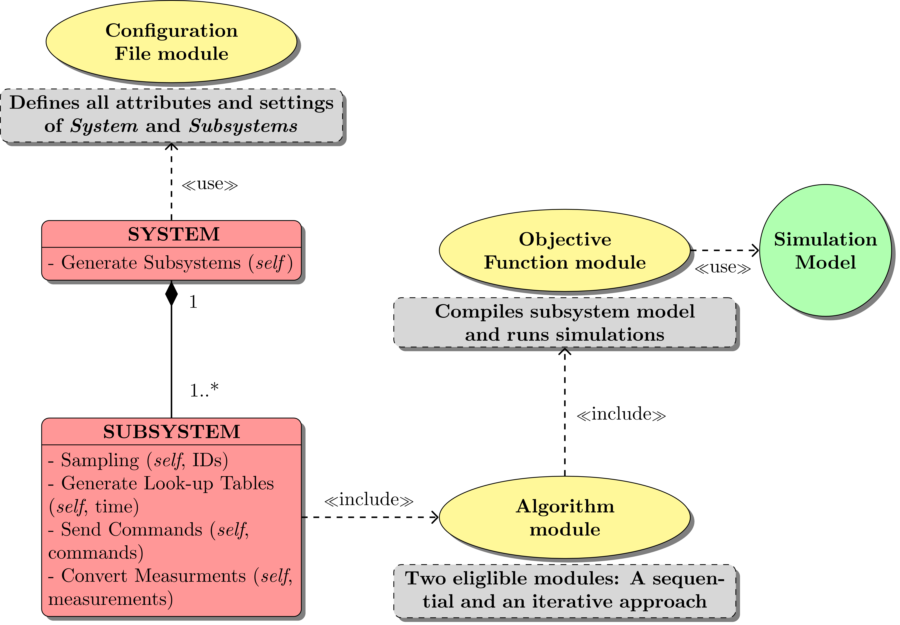

# pyDMPC

### Overview
Distributed model predictive control (DMPC) is a promising approach that avoids the construction of a complex model of the total system and thus facilitates modelling and supports the use of exact simulation models.

DMPC divides the optimization problem into sub-problems, with the advantage that pre-fabricated simulation models from standard libraries and models provided by component manufacturers can be used. Moreover, each optimization problem, considered for its own, becomes smaller and, in whole, can be solved faster compared to an integrated system model.

The distributed optimizations must be coordinated to achieve near-global-optimum performance. This coordination requires a suitable scheme, which, in many publications, is based on iterative data exchange between the subsystems. In previous works, the authors developed a non-iterative algorithm based on the exchange of lookup tables.

The developed control framework is able to construct a system composed of subsystems merely on the basis of a configuration file. Using the information provided in the configuration file, the specified system is generated as an object of the system class. This class, in turn, is equipped with a method for generating subsystems, in which all given characteristic attributes are assigned to the corresponding subsystem object. Important attributes of a subsystem include, e.g., any kind of constraints, names of decision variables and the hierarchical position.

The control framework furthermore includes a module containing the specific control algorithm. At the moment, one may choose between the sequential algorithm working with look-up tables and the iterative one. By including a further module, the objective function is integrated into the control algorithm. This  module contains an interface, which starts the subsystem model simulation.

The basic control framework structure is illustrated in the following figure:

### Installation

If you actively develop pyDMPC you can clone this repository by using:

 `git clone [SSH-Key/Https]`

and then run:

 `pip install -e [Path/to/your/pyDMPC/Clone]` which will install the local version of pyDMPC.

### Dependencies

If you intend to use Modelica models: pyDMPC currently works with the Dymola Python interface.
- pathos
- modelicares
- pyFMI (see below)

### pyFMI
In order to use pyFMI, please follow these instructions:
- Download wheel files pyFMI and assimulo for your python version (https://www.lfd.uci.edu/~gohlke/pythonlibs/)
- execute `pip install wheel_file_path.whl`

### Documentation
The control approaches are described in  [Introduction](Tutorial/Introduction.md).

Try out the short [Tutorial](Tutorial/Tutorial.md).

### Use the GUI - in progress -
Wooey is a browser-based UI.

cd C:\WinPython-64bit-3.6.2.0\scripts\ProjectName

celery -A ProjectName worker --pool=eventlet -l info

python manage.py runserver

### How to cite pyDMPC

We continuously improve **pyDMPC** and try to keep the community up-to-date with citable papers:

- Distributed exergy-based simulation-assisted control of HVAC supply chains.
  Baranski M., Fütterer J., Müller D..
  Energy and Buildings, in press.
  [link](https://doi.org/10.1016/j.enbuild.2018.07.006)
