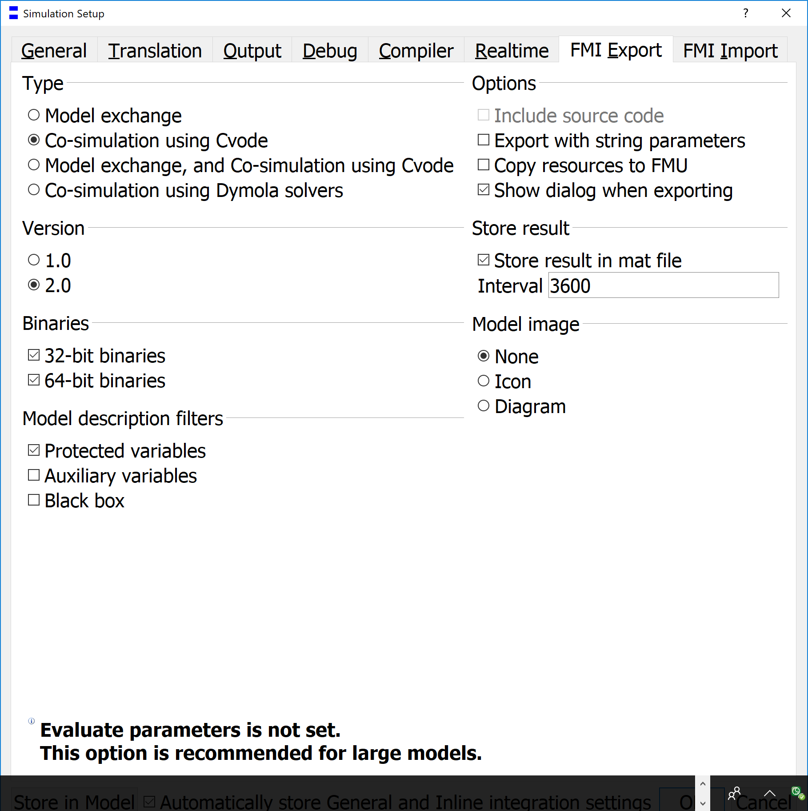

# AHU use case

## Overview
This is a demonstration, in which the Scikit models are used to control an
air handling unit (AHU).

The task is to control the supply air temperature, while the outdoor
temperature fluctuates.

### Provide the Scikit models
The models are Multi-Layer Perceptron (MLP) models created with Scikit-learn.
You can use the frozen models stored in

pyDMPC\pyDMPC\SpecialStudies\FrozenModels\AHU

and copy them and the corresponding scalers (required to scale the inputs for
the MLP) to the working directory. If you would like to create the models from Modelica models, you can use this [script](../pyDMPC/Utilities/mlp_train_modelica.py). This script requires an FMU (see settings below) of the
heater and cooler models in

ModelicaModels.SubsystemModels.DetailedModels.HeaterML and
ModelicaModels.SubsystemModels.DetailedModels.CoolerML

### Controlled system (AHU)
The central AHU model is stored in this path in the ModelicaModels package of
pyDMPC

ModelicaModels.ControlledSystems.ControlledSystemBoundaries

Use Dymola to export the model to a functional mockup unit (FMU) according to
the following settings:

The FMU filename and the file's location has to be included into the Init.py.

### Settings
All settings are given in the Init.py according as described in the
[Settings](Settings.md).
