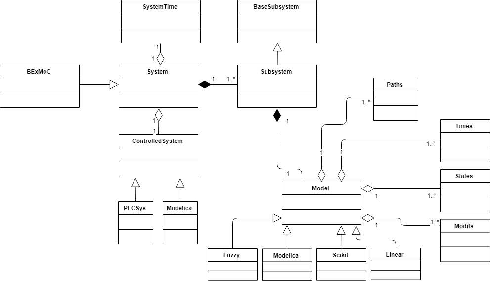

# Overview of the reference implementation

The reference implementation allows applying two specific DMPC algorithms to the AHU and the test hall use case. 
The following figure shows a simplified class diagram. 

## System
The System module is used to generate a set of subsystems (agents) that perform the actual control task. It is also useful to define the overall algorithm. In the reference implementation, this algorithm is called BExMoC and simply inherits from the System class. 

## Subsystem
The Subsystem module contains the definition of the subsystems (agents). In the BaseSubsystem class, only the main attributes are defined. 

## Modeling
The Modeling module contains various model classes. It also contains a States class, which is important for distinguishing the different types of state variables. 

## Init
The Init module contains all initial data. The entire module can be replaced for a new case study and it is up to the user to define what to provide and how to provide it. In the reference implementation, all values are written directly into the module but in other case studies, it may as well hold functions reading a separate configuration file. 

## Experiment
The Experiment module is intended as an entry point. It contains the main() function and triggers the execution of control algorithms. It can also be used to ensure a basic synchronization with the controlled system. 

## ControlledSystem
The ControlledSystem module contains classes for interacting with the controlled system. Currently, classes are provided that allow using 
- an FMU
- a Beckhoff PLC
as controlled system. 

## SystemTime
The SystemTime module is intended to provide global clocks for all other modules. It distinguishes the simulated controlled system (FMU) and the real-life controlled system (PLC, API). 